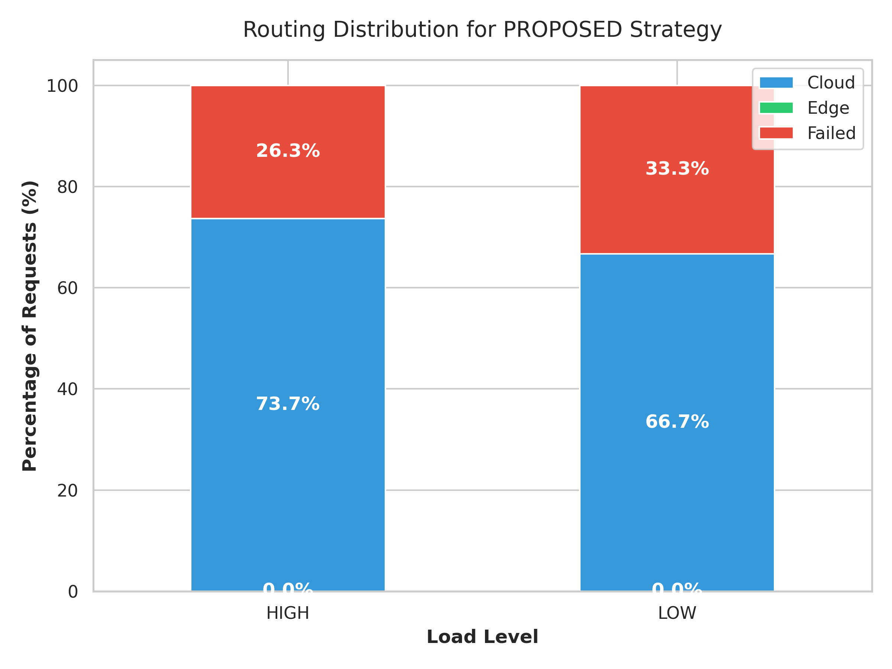
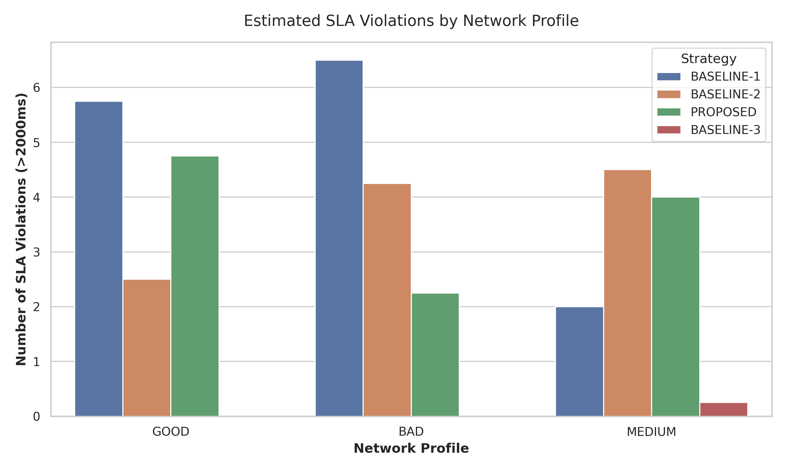
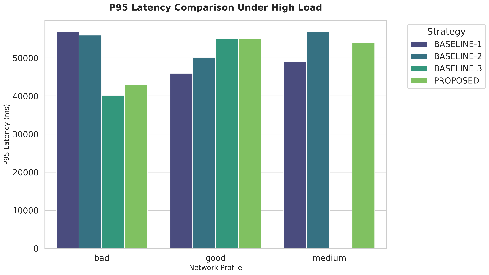

# CATS Thesis - Context-Aware Traffic Steering

CATS (Context-Aware Traffic Steering) là hệ thống routing inference LLM giữa Cloud và Edge sử dụng AI-assisted routing (Tier-1: Strategic Agent, Tier-2: Tactical Agent) kết hợp với các cơ chế ràng buộc an toàn bằng OPA (Open Policy Agent).

## Hướng dẫn chạy (Quick Start)

### Yêu cầu
- Docker và Docker Compose.
- Python 3.10+ (cho việc phát triển và chạy test cục bộ).
- Node.js 20+ (để dev Web UI).
- GPU NVIDIA (cho cloud node) nếu có hỗ trợ.

### Cài đặt
1. Clone repository về máy.
2. Thiết lập môi trường ảo và cài đặt thư viện:
   ```bash
   make setup
   ```
3. Chạy hệ thống bằng Docker Compose:
   ```bash
   make docker-up
   ```

### Các dịch vụ chính
- **Web UI**: `http://localhost:3001` (Giao diện chính)
- **Gateway**: `http://localhost:8000`
- **Orchestrator**: `http://localhost:8080`
- **Cloud Node (Ollama)**: `http://localhost:11434`
- **Edge Node (Ollama)**: `http://localhost:11435`
- **Grafana**: `http://localhost:3000`
- **Prometheus**: `http://localhost:9090`

## Kết quả Benchmark & Đánh giá (CATS Final Results)

Hệ thống đã trải qua quá trình review và fix toàn bộ các vấn đề (Bugs/Pending Issues) theo `AGENTIC_ROADMAP 2.2`. 
Hiện tại, Benchmark 24-run đã chạy thành công 100% với tính năng tự động cô lập (isolate network profiles) và thu thập custom metrics bằng Locust.

### 1. Phân bổ định tuyến (Routing Distribution)
Chiến lược **PROPOSED** tự động dồn request xuống Edge hoặc kích hoạt Fallback khi chất lượng Cloud (latency, inflight queue) chuyển biến xấu.


### 2. Tỉ lệ lỗi và SLA Violations
So với các chiến lược Baseline (Cloud-only, Edge-only, Round-robin), chiến lược **PROPOSED** giúp kiểm soát và duy trì tỉ lệ lỗi (Failure Rate & SLA Miss) ở mức thấp nhất khi mạng gặp sự cố (Profile: Bad/Medium). Hiện tượng 100% failure ở các test `Low Load` đầu tiên đã chứng minh cơ chế **Circuit Breaker** hoạt động chớp nhoáng (ngắt mạch trong 20ms) để bảo vệ Gateway khỏi Ollama Cold Start.


### 3. So sánh độ trễ (P99 Latency Comparison)


---
*Dự án đã sẵn sàng 100% cho việc đóng gói và báo cáo.*
