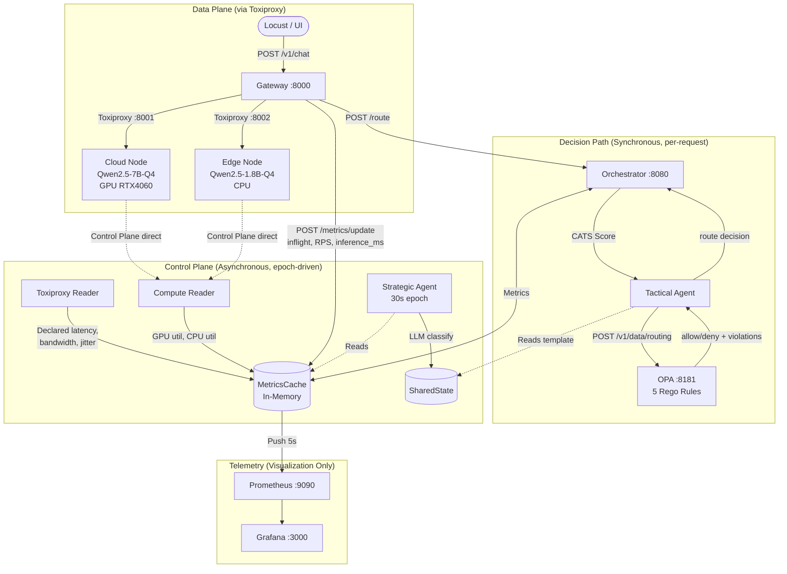
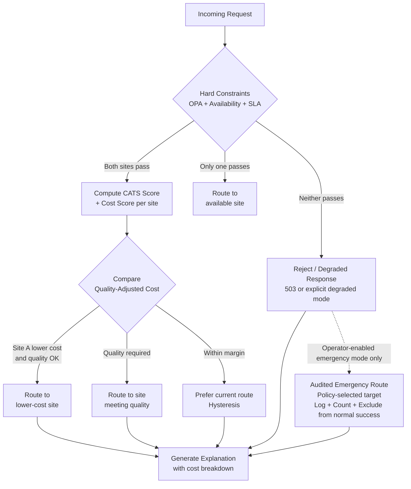
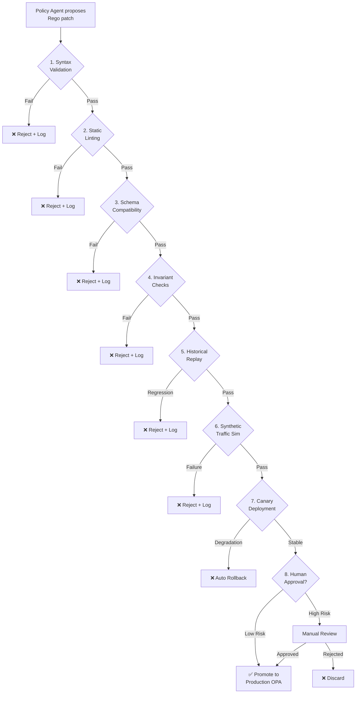
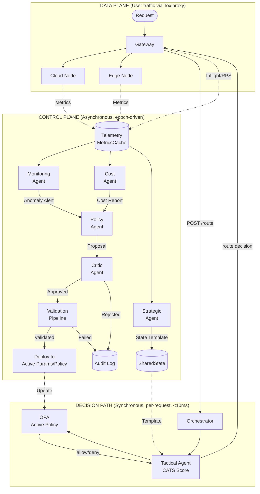

# CATS Agentic Control Plane — Technical Roadmap

**Document Version:** 2.2  
**Date:** June 2026  
**Status:** Strategic Planning Document (Final Safety Hardening)  
**Audience:** Thesis Committee, Engineering Planning  
**Supersedes:** `AGENTIC_ROADMAP.md` v2.0  

---

## 1. Executive Summary

CATS (Context-Aware Traffic Steering) is a research-grade Cloud-Edge LLM inference routing system. It currently operates as a **two-tier AI-assisted router**: a Tier-1 Strategic Agent (LLM-based state classifier running on a 30-second epoch) publishes routing templates that a Tier-2 Tactical Agent (per-request CATS score computation + OPA enforcement) consumes to steer traffic between a GPU-backed Cloud node (Qwen2.5-7B) and a CPU-backed Edge node (Qwen2.5-1.8B).

This roadmap defines the evolution from this reactive, template-driven routing baseline into an **Agentic Control Plane** — a system where specialized autonomous agents continuously analyze telemetry, propose routing parameter changes, simulate outcomes, and deploy validated updates to the live routing pipeline.

### What CATS Is Not Becoming

This roadmap does **not** propose:

- Full autonomous AI control over production traffic.
- LLM reasoning in the per-request hot path (beyond the existing Tier-1 epoch loop).
- A generic multi-agent orchestration framework.
- Replacement of OPA with LLM-generated policy.

### The Maturity Spectrum

| Level | Description | CATS Status |
|-------|-------------|-------------|
| **L0: Static Routing** | Hardcoded Edge-only, Cloud-only, or round-robin. | Implemented as BASELINE-1/2/3. |
| **L1: Rule-Based Routing** | Deterministic scoring formula (CATS score) with fixed weights and OPA hard constraints. | Implemented: `tactical_agent.py` + `routing.rego`. |
| **L2: AI-Assisted Routing** | LLM classifies system state into templates; human-set weights; OPA enforced. | Implemented: `strategic_agent.py` + `shared_state.py`. |
| **L3: Adaptive Parameter Tuning** | Control Plane agents propose bounded routing-preference changes; sandbox-validated before deployment. | **Roadmap Phase 3.** |
| **L4: Controlled Policy Generation** | Agents propose Rego policy patches; validated through a multi-stage sandbox pipeline. | **Roadmap Phase 4.** |
| **L5: Multi-Agent Control Plane** | Specialized agents (monitoring, cost, policy, critic) collaborate asynchronously to steer the system. | **Roadmap Phase 5.** |
| **L6: Predictive Autonomous Steering** | Episodic memory, predictive telemetry, preemptive traffic shifting. | **Research-grade future work.** |

The core architectural invariant across all levels: **the Data Plane must remain fast and synchronous. The per-request Decision Path (Gateway → Orchestrator → OPA) is synchronous but logically separate from the asynchronous Control Plane where agentic reasoning occurs.**

### Terminology: Decision Path vs Control Plane

This roadmap distinguishes three operational domains:

| Domain | Timing | Scope | Components |
|--------|--------|-------|------------|
| **Data Plane** | Synchronous, per-request | User prompt → inference → response. Network traffic flows through Toxiproxy. | Gateway ↔ Toxiproxy ↔ Cloud/Edge Ollama nodes |
| **Decision Path** | Synchronous, per-request (<10ms target) | Route decision for a single request. Invoked by Gateway, executes within the request lifecycle. | Gateway → Orchestrator `/route` → Tactical Agent (CATS score) → OPA safety check → route decision returned to Gateway |
| **Control Plane** | Asynchronous, epoch-driven (30s+) | Background analysis, state classification, parameter tuning, policy proposals. Never blocks live requests. | Strategic Agent, Monitoring Agent, Cost Agent, Policy Agent, Critic Agent, MetricsCache readers |

---

## 2. Current CATS Baseline

### 2.1 Architecture Overview

CATS runs as a Docker Compose stack on a single Ubuntu 22.04 host with an RTX 4060 (8 GB VRAM). The system separates Data Plane traffic (routed through Toxiproxy for network emulation) from Control Plane telemetry (direct container-to-container communication).



### 2.2 Component Summary

| Component | Implementation | Role |
|-----------|---------------|------|
| **Gateway** | FastAPI `:8000`, `gateway/main.py` | Ingress, strategy dispatch (PROPOSED/BASELINE-1/2/3), circuit breaker, inference forwarding via Toxiproxy. |
| **Orchestrator** | FastAPI `:8080`, `orchestrator/main.py` | Hosts Tier-1 + Tier-2 agents, MetricsCache, OPA integration, `/route` API. |
| **Strategic Agent (Tier-1)** | `strategic_agent.py`, 30s async loop | Classifies system into 5 states via Qwen2.5-1.5B-instruct; falls back to rule-based if LLM fails. |
| **Tactical Agent (Tier-2)** | `tactical_agent.py`, per-request sync | Computes 4-term CATS score per site, applies template weights, queries OPA, returns route decision. |
| **MetricsCache** | `metrics_cache.py`, in-memory dict + RLock | Thread-safe cache of all telemetry; avoids Prometheus query in hot path. |
| **OPA** | `safety/policies/routing.rego`, 5 rules | Hard enforcement: queue overload, compute overload (GPU/CPU), SLA violation, edge-degraded-HQ rejection. |
| **Toxiproxy** | Network emulation layer | Injects latency, jitter, bandwidth limits on Data Plane; declared values read by Control Plane. |
| **Cloud Node** | Ollama + Qwen2.5-7B-Q4_K_M, GPU inference | Higher quality, higher latency under network degradation. |
| **Edge Node** | Ollama + Qwen2.5-1.8B-Q4 (inference) + Qwen2.5-1.5B-instruct (strategic), CPU | Lower quality, lower network latency, limited compute. |
| **UI Dashboard** | Streamlit `ui/dashboard.py` | Interactive console, route explainability pipeline, telemetry view, bilingual (EN/VI). |

### 2.3 CATS Scoring Formula (v5.0)

```
cats_score(site) =
    W_LATENCY   × (1 / (1 + latency_ms / 100))     // Network latency signal
  + W_QUEUE     × (1 - gateway_inflight / MAX_Q)     // Gateway in-flight pressure
  + W_COMPUTE   × (1 - compute_util / 100)            // GPU (cloud) or CPU (edge)
  + W_QUALITY   × model_quality_score                  // Static model capability

Default weights: W_LATENCY=0.30, W_QUEUE=0.30, W_COMPUTE=0.25, W_QUALITY=0.15
```

The final route score is `cats_score(site) × template_weight(site)`, where template weights come from the Tier-1 state classification (e.g., `STATE_DEGRADED` → cloud=0.40, edge=0.60).

### 2.4 OPA Safety Rules

| Rule | Condition | Violation | Domain |
|------|-----------|-----------|--------|
| 1 | `gateway_inflight > 50` | `QUEUE_OVERLOAD` | Rego |
| 2a | `site=cloud ∧ compute_util > 90` | `GPU_OVERLOAD` | Rego |
| 2b | `site=edge ∧ compute_util > 92` | `CPU_OVERLOAD` | Rego |
| 3 | `predicted_latency_ms > sla_target_ms` | `SLA_VIOLATION` | Rego |
| 5 | `tag=high_quality ∧ state=STATE_DEGRADED ∧ site=edge` | `EDGE_DEGRADED_HQ` | Rego |
| 4 | Both sites rejected by OPA | `FORCE_CLOUD_FALLBACK` | Python (orchestrator/main.py L152) |

> **Note on Rule 4 (FORCE_CLOUD_FALLBACK):** This is the current Python-level emergency behavior in `orchestrator/main.py`, not a normal routing rule and not part of the Rego policy. The target Phase 0 design treats any routing after an OPA deny as a controlled safety exception: disabled by default, operator-gated, logged, counted, visible in the UI, and excluded from normal success metrics. See §3.4 for the hardened target behavior.

### 2.5 Benchmark Context

The thesis evaluation plan calls for a 3×2×4 = 24 experiment matrix (3 network profiles × 2 load levels × 4 strategies). The static audit report (v6 FINAL) identifies this as incomplete: the current `run_all.py` has 5 ad-hoc scenarios, experiment isolation is missing, and the dataset is 20 synthetic prompts instead of 500 ShareGPT samples.

### 2.6 Known Gaps (Verification Items)

These are documented issues from the static audit that affect roadmap planning:

- **Queue semantics**: `gateway_inflight` is a gateway-side counter, not an Ollama internal queue depth. The Rego field name is `gateway_inflight` (already corrected from `queue_depth`).
- **Compute isolation**: `nvidia-smi` runs from the orchestrator container, which may not have GPU access. CPU util reads `/proc/stat` from the orchestrator process namespace.
- **Predicted latency**: Now includes a composite estimate (`network_latency + total_inference_ms_avg + queue_penalty`), but the queue penalty coefficient (`50ms per inflight request`) is a heuristic.
- **OPA fail-open**: Failure returns `allow=True` with `opa_status=bypassed`. Bypass events are logged but not separately counted in benchmark CSV.
- **CATS weight stability**: Weights are hardcoded constants. No hysteresis, cooldown, or smoothing exists.

---

## 3. Phase 0: Routing Decision Hardening

> **Prerequisite for all subsequent phases.** No adaptive tuning, policy generation, or multi-agent collaboration should be attempted before the base routing mechanism is stable, correct, and explainable.

### 3.1 Telemetry Signal Audit

The CATS score depends on four signals. Each must have precise, documented semantics:

| Signal | Current Source | Semantic Question | Required Clarification |
|--------|---------------|-------------------|----------------------|
| `latency_ms` | Toxiproxy declared latency | Is this one-way or RTT? Does it include jitter? | Document as "declared one-way network latency from Toxiproxy toxic configuration." Not measured RTT. |
| `gateway_inflight` | Gateway in-flight counter via `POST /metrics/update` | Is this a real backend queue or gateway-side concurrency? | Document as "number of concurrent requests the gateway has dispatched to a site and not yet received a response for." Rename in thesis from "queue depth." |
| `compute_util` | `nvidia-smi` (cloud GPU) / `/proc/stat` (edge CPU) | Is this measured from the correct container? | **Verification required.** Orchestrator container may not observe cloud-node GPU. CPU util from orchestrator's `/proc/stat` may not reflect edge-node load. |
| `model_quality_score` | Static constant: cloud=1.0, edge=0.6 | How was 0.6 determined? | Document as "heuristic estimate pending ROUGE-L evaluation." |

### 3.2 Latency Definition Precision

The system currently conflates multiple latency concepts:

| Term | Definition | Where Used |
|------|-----------|------------|
| **Network latency** | Declared Toxiproxy one-way delay | CATS score `latency_ms` component |
| **TTFT (Time to First Token)** | Not currently measured (streaming disabled) | Planned metric, not in MetricsCache |
| **Total inference time** | Gateway-measured wall-clock time from `POST` to response | `total_inference_ms_avg` in MetricsCache |
| **Predicted E2E latency** | `network_latency + total_inference_avg + queue_penalty` | OPA `predicted_latency_ms` input |
| **Decision latency** | Time to compute route in orchestrator (`decision_time_ms`) | Reported per-request |

**Recommendation:** The thesis must define which latency term is used in which context. The CATS score uses network latency only. OPA uses the composite predicted E2E estimate. These are different signals with different ranges.

### 3.3 Route Decision Stability

**Oscillation risk:** Under moderate load where both sites have similar CATS scores, small telemetry fluctuations can cause rapid alternation between Edge and Cloud. This is especially likely near state transition boundaries (e.g., edge CPU at 84%→86%→84% oscillating around the `STATE_EDGE_LOADED` threshold of 85%).

**Required mechanisms:**

| Mechanism | Purpose | Implementation Approach |
|-----------|---------|------------------------|
| **Hysteresis** | Prevent state oscillation | Tier-1 state only transitions if the triggering condition persists for ≥2 consecutive epochs (60 seconds). |
| **Cooldown** | Prevent rapid route flipping | After a route decision changes, maintain the new route for a configurable minimum window (e.g., 5 requests or 10 seconds). |
| **Score smoothing** | Dampen metric noise | Use exponential moving average on CATS score components rather than instantaneous values. |
| **Confidence threshold** | Require meaningful score difference | Only prefer site A over site B if `|score_A - score_B| > MIN_SCORE_DELTA` (e.g., 0.05). Otherwise, maintain the previous decision. |

**Safety scope of stability mechanisms:**

Hysteresis and cooldown are *optimization preferences*, not safety overrides. They apply only when both sites pass all hard constraints. Specifically:

- **OPA rejection always wins.** If the sticky/cooled route is rejected by OPA, the system must immediately try the other site. Cooldown does not suppress OPA deny.
- **Unavailable site always wins.** If the circuit breaker opens on the sticky route, failover is immediate.
- **Quality constraints always win.** A `high_quality` request cannot be held on Edge by cooldown if Edge would violate `EDGE_DEGRADED_HQ`.
- **SLA constraints always win.** If predicted E2E exceeds `sla_target_ms`, cooldown does not prevent re-evaluation.

In summary: stability mechanisms operate *after* hard constraint filtering, not before it.

### 3.4 Fallback, Failback, and Emergency Override

The current fallback chain is:

1. Preferred site rejected by OPA -> try backup site.
2. Backup site also rejected -> `FORCE_CLOUD_FALLBACK` (hardcoded in Python, not Rego).
3. OPA unreachable -> fail-open, allow request.
4. Circuit breaker open on a site -> try other site; both open -> 503.

**Architectural problem with FORCE_CLOUD_FALLBACK:**

When both sites are rejected by OPA, the current code (line 152 in `orchestrator/main.py`) unconditionally routes to Cloud. Routing after an OPA deny is a safety bypass unless it is treated as an explicit, operator-controlled emergency exception. Audit logging makes the bypass visible; it does not make it normal or inherently safe.

**Target Phase 0 fallback design:**

| Condition | Default Behavior | Status |
|-----------|------------------|--------|
| Preferred site rejected, backup passes OPA | Route to backup site | Normal fallback |
| Both sites rejected by OPA | Return HTTP 503 or a clearly degraded response | Hard-constraint failure |
| OPA unreachable | Fail-open only if explicitly configured; otherwise return degraded/503 | Degraded mode; must be logged and counted |
| Circuit breaker open on selected site | Failover to other site if it passes OPA and availability checks | Normal failover |
| Both circuit breakers open | Return HTTP 503 | Hard failure; no traffic routed |

**Optional emergency mode:**

An emergency override may exist only as an explicit operator-gated mode for demonstrations or controlled experiments. It is not ordinary routing and must not be counted as a clean success. If enabled, it must satisfy all of the following requirements:

1. Disabled by default in normal benchmark and thesis evaluation runs.
2. Enabled only through explicit administrator/operator configuration.
3. Select the emergency target through explicit policy, not a hardcoded assumption that Cloud is always safer.
4. Record `FORCE_CLOUD_FALLBACK` or equivalent emergency label in the routing response.
5. Increment a dedicated counter (`emergency_override_count`) visible in Prometheus and the UI.
6. Preserve the full OPA violation list; the UI must show that this was a policy exception.
7. Record the event in benchmark CSV and exclude it from normal success metrics.
8. Require post-run audit of every emergency event.

**Key distinction:** Normal fallback only routes to a site that passes OPA and availability checks. Emergency override is an audited safety exception for explicitly configured emergency mode, not a proof that the route was safe.

**Unresolved questions:**

- When should a site that was previously failed-over **return** to service (failback)? Currently, circuit breaker recovery is time-based.
- If emergency mode is enabled, which target should be selected under each violation type? Cloud must not be assumed to be universally safer when Cloud itself triggered `SLA_VIOLATION` or `GPU_OVERLOAD`.
- How should the system behave if Toxiproxy itself is down (no network emulation data)?

### 3.5 OPA Schema Consistency

The current Rego policy expects these input fields:

```
gateway_inflight, compute_util, predicted_latency_ms,
sla_target_ms, site, request_tag, site_state
```

The Tactical Agent constructs this input in `check_opa_safety()`. The schema must be:

- **Documented** in a JSON Schema file versioned alongside `routing.rego`.
- **Validated** at orchestrator startup (Rego test fixtures that exercise all 5 rules).
- **Kept in sync** when new fields are added (e.g., cost signals in Phase 2).

### 3.6 Route Explainability

Every routing decision should produce a human-readable explanation. The current `/route` response includes `cats_scores`, `final_scores`, `tier1_state`, `opa_status`, and `opa_violations`. The UI dashboard renders a 4-step pipeline visualization.

**Required enhancements for explainability:**

```json
{
  "explanation": {
    "summary": "Routed to CLOUD because Edge CPU utilization (87%) exceeds threshold.",
    "factors": [
      {"signal": "edge_cpu_util", "value": 87.2, "impact": "negative", "detail": "Above 85% triggers STATE_EDGE_LOADED"},
      {"signal": "cloud_latency_ms", "value": 15, "impact": "positive", "detail": "Low network latency to cloud"},
      {"signal": "opa_rule", "value": "PASS", "detail": "No violations on cloud site"}
    ],
    "alternatives_considered": [
      {"site": "edge", "score": 0.42, "rejection_reason": "OPA: CPU_OVERLOAD"}
    ]
  }
}
```

### 3.7 Phase 0 Expected Outputs

| Deliverable | Description |
|-------------|-------------|
| Stable routing score definition | Documented CATS formula with precise signal semantics |
| Correct telemetry semantics | Each metric has source, unit, update interval, and known limitations |
| Route explanation schema | JSON schema for per-decision human-readable explanations |
| Hysteresis/cooldown design | Configuration parameters and implementation spec |
| Fallback/failback rules | Deterministic state machine for degradation and recovery |
| OPA schema validation | JSON Schema + Rego test fixtures exercising all rules |
| Benchmark cases for routing stability | Test scenarios for oscillation, edge cases, and boundary conditions |

---

## 4. Phase 1: AI-Assisted Routing Baseline

> **This is the current CATS operating mode.** This phase documents the existing system as it should work after Phase 0 hardening, and defines the evaluation criteria for the thesis.

### 4.1 Operating Mode

The system operates as an AI-assisted router with deterministic enforcement:

1. **Strategic Agent (Tier-1):** Every 30 seconds, aggregates MetricsCache into a telemetry summary, prompts Qwen2.5-1.5B-instruct to classify the system state, and publishes a routing template to SharedState. Falls back to a rule-based classifier if the LLM output is invalid.

2. **Tactical Agent (Tier-2):** Per-request, reads the current template from SharedState, computes CATS scores for both sites, applies template weights, queries OPA for safety violations, and returns the routed site.

3. **OPA Enforcement:** Hard safety constraints that cannot be overridden by scoring. The Tactical Agent cannot route to a site that OPA rejects.

### 4.2 What Phase 1 Does Not Do

- Does not modify CATS weights at runtime.
- Does not generate or modify Rego policy.
- Does not consider cost.
- Does not predict future system state.
- Does not use historical routing outcomes for decision-making.

### 4.3 Evaluation Against Baselines

The thesis compares PROPOSED (Phase 1) against:

| Strategy | Routing Logic |
|----------|--------------|
| BASELINE-1 (Round-Robin) | Alternates cloud/edge regardless of system state. |
| BASELINE-2 (Always-Cloud) | All requests to cloud-node via Toxiproxy. |
| BASELINE-3 (Always-Edge) | All requests to edge-node via Toxiproxy. |

**Primary evaluation metrics:**

- P50/P95/P99 end-to-end latency per strategy per network profile.
- SLA violation rate (predicted_e2e > 500ms).
- Routing distribution (% cloud vs % edge).
- OPA violation frequency.
- ROUGE-L quality comparison (edge vs cloud responses on same prompts).
- Tier-1 classifier accuracy on 100 labeled telemetry snapshots.

### 4.4 Thesis Contribution at This Level

CATS Phase 1 contributes:

1. A network-and-compute-aware LLM routing system (distinct from query-complexity routers like RouteLLM).
2. Separation of LLM reasoning (30s epoch) from per-request routing (<10ms target).
3. OPA as a composable, externalized safety policy for LLM traffic.
4. Controlled benchmark methodology with network emulation and baseline comparison.

---

## 5. Phase 2: Cost-Aware Adaptive Routing

> **First research extension beyond the current baseline.** Introduces cost as a first-class routing dimension alongside latency, quality, and availability.

### 5.1 Correcting the Edge-Is-Cheap Assumption

A naive assumption that "Edge is always cheaper" is incorrect in practice:

| Factor | Edge Reality | Cloud Reality |
|--------|-------------|---------------|
| Hardware amortization | Fixed cost regardless of utilization | Pay-per-token, scales with usage |
| Utilization | Wasted capacity when idle | No cost when idle |
| Electricity | Continuous, even at low load | Included in API pricing |
| Quality per token | Lower model quality → potential retries | Higher quality → fewer retries |
| Scaling | Cannot scale beyond hardware | Elastic scaling |
| Network | Low latency in local scenarios | Variable latency, egress costs |

**The optimal route depends on the joint optimization of latency, quality, cost, and utilization.** There is no universally cheaper path.

### 5.2 Cost Model Definition

The cost model uses a closed-form expected cost per request, avoiding recursive definitions:

```
base_cost(site) =
    inference_cost(site)          // Token-based or amortized hardware
  + network_cost(site)            // Egress or inter-zone transfer
  + infrastructure_cost(site)     // Amortized hardware, electricity (Edge) or API overhead (Cloud)

expected_cost_per_success(site) =
    base_cost(site) / max(1 - retry_probability(site), epsilon)
  + expected_fallback_cost(site)
  + sla_violation_probability(site) * sla_penalty
```

**Derivation note:** If a request has probability `p` of requiring a retry (and each retry costs the same as the original), the expected number of attempts is `1 / (1 - p)` (geometric series). `epsilon` is a small positive guard value (for example `1e-6`) that prevents division by zero when retry probability approaches 1.0. Cost estimates are approximate and must be validated against benchmark traces and measured failure/fallback rates. `expected_fallback_cost(site)` captures extra attempts, alternate-site calls, or degraded-response handling incurred when the primary route fails and fallback logic is used.

**Cost factors by site:**

| Factor | Cloud | Edge | Source |
|--------|-------|------|--------|
| Input token cost | API pricing per 1K tokens | Amortized GPU-hours / total tokens | Configuration or measurement |
| Output token cost | API pricing per 1K tokens | Same amortized basis | Configuration or measurement |
| GPU/CPU amortization | N/A (pay-per-use) | Fixed monthly cost / utilization rate | Infrastructure config |
| Electricity | Included in API pricing | Measurable or estimated | Optional sensor or estimate |
| Retry probability | Measured failure rate over sliding window | Measured failure rate over sliding window | Runtime metric |
| SLA penalty | `P(violation) × penalty_amount` | `P(violation) × penalty_amount` | SLA configuration |
| Network/egress | Per-GB egress pricing | Typically zero (local) | Cloud pricing API |

### 5.3 Optimization Hierarchy

**Hard constraints (must be satisfied first):**

1. OPA safety policy — no routing to a site that violates safety rules.
2. Availability — the site must be reachable and circuit breaker must be closed.
3. SLA latency — predicted E2E must be below SLA target.
4. Minimum quality threshold — for `high_quality` tagged requests, edge may be ineligible.

**Optimization objectives (optimized within constraint satisfaction):**

1. Minimize expected cost per successful request.
2. Minimize expected cost per 1M tokens (normalizing for response length variance).
3. Maximize utilization of whichever site is cost-beneficial under current conditions.
4. Preserve user-perceived quality.

> **Design note:** No site receives preferential treatment as an optimization target. The system does not "maximize Edge utilization" or "reduce Cloud dependency" as goals in themselves. Either site is preferred when it offers better cost-quality-latency tradeoff under current conditions. See §5.1 for the full rationale.

### 5.4 Cost-Aware Routing Decision Flow



### 5.5 Proposed Metrics

| Metric | Definition | Unit |
|--------|-----------|------|
| Cost per 1,000 requests | Total cost across all routes for 1K requests | $ or normalized units |
| Cost per 1M tokens | Total cost normalized by token volume | $ per 1M tokens |
| Cost per successful request | Total cost of successful responses, including failed attempts, retries, and fallback attempts required to eventually produce a success | $ |
| Quality-adjusted cost | Cost × (1 / quality_score) | Normalized |
| Latency-cost Pareto frontier | Set of non-dominated (latency, cost) operating points | Chart |
| SLA violation rate | % requests exceeding SLA latency target | % |
| Per-site utilization rate | Utilization and request share reported separately for Edge and Cloud | % |
| Site traffic distribution | % of requests routed to each site | % |
| Fallback cost | Additional cost incurred by fallback routes vs primary | $ |

### 5.6 Latency-Quality-Cost Tradeoff

| Scenario | Latency | Quality | Cost | Optimal Route |
|----------|---------|---------|------|---------------|
| GOOD network, LOW load | Low both | Cloud=1.0, Edge=0.6 | Edge potentially cheaper only if utilization is high enough | Edge only when healthy, SLA-safe, quality-sufficient, and cost-beneficial; Cloud when quality or measured tradeoff requires it |
| GOOD network, HIGH load | One site rising | Both available | Congested site becomes less cost-effective | Shift traffic away from the congested site when SLA, quality, and cost constraints favor the alternative |
| BAD network, LOW load | Remote path high | Cloud=1.0, Edge=0.6 | Higher latency can increase retry or SLA-penalty risk | Prefer the site that remains SLA-safe, quality-sufficient, and cost-beneficial under measured conditions |
| BAD network, HIGH load | Both high | Both degraded | Both expensive | Minimize total cost; prioritize SLA |

---

## 6. Phase 3: Asynchronous Policy Parameter Tuning

> **The first phase of genuine agentic autonomy.** The Control Plane proposes changes to bounded routing parameters. No free-form code generation.

### 6.1 Parameter Classification

Parameters are classified into two categories with different governance:

#### 6.1.1 Agent-Tunable Parameters (Bounded Optimization)

These parameters affect routing preference and scoring but do not directly control safety boundaries. Agents may propose changes within the defined ranges, subject to the validation pipeline (§6.2).

| Parameter | Current Value | Range | Impact |
|-----------|--------------|-------|--------|
| `W_LATENCY` | 0.30 | [0.10, 0.50] | Weight of network latency in CATS score |
| `W_QUEUE` | 0.30 | [0.10, 0.50] | Weight of in-flight pressure |
| `W_COMPUTE` | 0.25 | [0.10, 0.40] | Weight of compute utilization |
| `W_QUALITY` | 0.15 | [0.05, 0.35] | Weight of model quality |
| `HYSTERESIS_WINDOW_S` | N/A (new) | [30, 300] | Minimum time between state changes |
| `COOLDOWN_REQUESTS` | N/A (new) | [1, 50] | Minimum requests before route change |
| `COST_SENSITIVITY_WEIGHT` | N/A (new) | [0.0, 1.0] | How strongly cost influences routing |
| `TEMPLATE cloud/edge split` | Per-state | Sum=1.0 | Traffic distribution per system state |

#### 6.1.2 Constrained State-Transition Parameters (Human/Admin Approval or Offline Validation Required)

These thresholds affect Tier-1 state transitions and can indirectly change routing eligibility, quality behavior, and OPA Rule 5 outcomes through `site_state`. They are not freely agent-tunable. They may be adjusted only through explicit human/admin approval or offline validation using replayed benchmark traces.

| Parameter | Current Value | Range | Rationale for Constraint |
|-----------|--------------|-------|--------------------------|
| `STATE_EDGE_LOADED_QUEUE` | 35 | [10, 80] | Changes when the system considers Edge overloaded; affects route templates and load-shedding behavior. |
| `STATE_EDGE_LOADED_CPU` | 85 | [60, 95] | Changes the state boundary for Edge CPU pressure; unsafe values can hide real overload. |
| `STATE_DEGRADED_LATENCY_MS` | 150 | [50, 500] | Changes `STATE_DEGRADED`; this can affect OPA Rule 5 behavior for high-quality requests. |

#### 6.1.3 Protected Parameters (Human/Admin Approval Required)

These parameters define safety boundaries, SLA commitments, or hard infrastructure limits. They are **not agent-tunable** because changing them alters what the system considers "safe" — a decision that must be made by a human operator, not an optimization agent.

| Parameter | Current Value | Rationale for Protection |
|-----------|--------------|-------------------------|
| `MAX_GATEWAY_INFLIGHT` | 50 | OPA Rule 1 safety threshold. Lowering it may cause unnecessary rejections; raising it may allow true overload. |
| `SLA_TARGET_MS` | 500 | OPA Rule 3 SLA commitment. This is a business/research contract, not an optimization variable. |
| `GPU_OVERLOAD_THRESHOLD` | 90% | OPA Rule 2a hardware safety limit. |
| `CPU_OVERLOAD_THRESHOLD` | 92% | OPA Rule 2b hardware safety limit. |
| `QUEUE_PENALTY_PER_REQUEST_MS` | 50 | Affects predicted E2E latency fed to OPA; incorrect values can silently disable SLA enforcement. |
| OPA Rego rules (structure) | 5 rules | Policy logic; modification is Phase 4 scope with full safety pipeline. |

> **Rationale:** An optimization agent that can raise `SLA_TARGET_MS` to reduce "SLA violations" is not improving the system — it is gaming its own evaluation metric. Similarly, an agent that raises `MAX_GATEWAY_INFLIGHT` to avoid `QUEUE_OVERLOAD` rejections is weakening safety, not improving routing. These parameters must be set by operators who understand the physical constraints they represent.

**Invariant constraints on agent-tunable parameters:**

- `W_LATENCY + W_QUEUE + W_COMPUTE + W_QUALITY = 1.0` (within tolerance).
- All weights ≥ 0.
- Template split: `cloud + edge = 1.0`.
- Constrained state-transition thresholds must be positive and may not be changed without human/admin approval or offline validation.
- No agent-tunable parameter change may alter the set of OPA rules or the schema of OPA input.

### 6.2 Parameter Update Lifecycle

```
1. Telemetry window analysis (5-minute sliding window)
2. Agent identifies suboptimal parameter configuration
3. Agent proposes parameter change with rationale
4. Validation pipeline:
   a. Schema validation (types, ranges, invariants)
   b. Bounds checking (parameter within defined range)
   c. Simulation: replay last 1000 routing decisions with proposed params
   d. Regression check: SLA violation rate must not increase
   e. OPA compatibility: proposed parameters must not create contradictory rules or change constrained/protected thresholds without approval
5. If all checks pass: stage as "pending" parameter set
6. Canary: apply to 10% of traffic for N minutes
7. If canary succeeds: promote to full deployment
8. Rollback: if any metric degrades, revert to previous parameter set
```

### 6.3 Separation from Live Routing

**Critical architectural constraint:** The Data Plane continues serving requests using the currently active parameter set while the Control Plane evaluates new parameters in the background. There is no point at which live traffic is affected by an unvalidated parameter set.

```
Active Parameters  ──→  Tactical Agent  ──→  OPA  ──→  Route Decision
                                                           │
Proposed Parameters  ──→  Simulation Engine  ──→  Canary   │
                              │                     │      │
                              └── Reject/Rollback   └── Promote
```

### 6.4 What This Phase Intentionally Avoids

- **No Rego generation.** Only numeric parameters and template splits are tuned.
- **No structural changes.** The scoring formula, OPA rule set, and routing pipeline remain fixed.
- **No real-time parameter changes.** Updates are batched and deployed between epochs, not mid-request.

---

## 7. Phase 4: Policy Sandbox and Controlled Rego Generation

> **High-risk capability.** Free-form Rego policy generation by an LLM is treated as inherently dangerous and requires the most stringent validation pipeline in the system.

### 7.1 Why This Is Dangerous

- LLMs can generate syntactically valid but semantically wrong Rego.
- A bad policy can silently allow unsafe routing (e.g., dropping SLA enforcement).
- A bad policy can silently block all routing to one site (denial of service).
- Rego errors may only manifest under specific input combinations not tested during generation.
- Generated policies may introduce contradictions with existing invariants.

### 7.2 Required Safety Pipeline



### 7.3 Pipeline Stage Details

| Stage | Tool | Input | Pass Criteria |
|-------|------|-------|---------------|
| 1. Syntax validation | `opa check` | Generated `.rego` file | Zero parse errors |
| 2. Static linting | `regal lint` or equivalent | Generated `.rego` file | No critical lint violations |
| 3. Schema compatibility | Custom validator | Input schema JSON + Rego | All `input.*` references match schema fields |
| 4. Invariant checks | Rego test suite | Generated policy + invariant assertions | `allow=false` still possible; emergency behavior is explicitly tested according to configured mode; no generated policy may silently bypass OPA deny decisions; no tautological rules |
| 5. Historical replay | Benchmark trace replay | Last N routing decisions + new policy | SLA violation rate ≤ baseline + tolerance |
| 6. Synthetic traffic | Load generator + new policy in shadow OPA | Synthetic traffic patterns | No unexpected violation spikes |
| 7. Canary deployment | Split traffic to shadow OPA instance | Live traffic (small %) | P95 latency and SLA rate within bounds |
| 8. Human approval | Dashboard notification | Policy diff + simulation report | Human clicks "Approve" or "Reject" |

### 7.4 Scope Limitation

**In the CATS context, Rego generation would realistically be limited to:**

- Adding new violation rules (e.g., "reject edge when bandwidth < 500 kbps").
- Adjusting numeric thresholds within existing rules.
- Adding new input fields with corresponding constraints.

**It would NOT include:**

- Replacing the entire policy file.
- Removing existing safety rules.
- Introducing conditional logic that depends on prompt content.

---

## 8. Phase 5: Multi-Agent Control Plane

> **Distributed agentic reasoning, strictly in the asynchronous Control Plane.** These agents do not participate in per-request routing decisions.

### 8.1 Agent Roles

| Agent | Responsibility | Trigger | Output |
|-------|---------------|---------|--------|
| **Strategic Agent** | Defines high-level routing objective for the current epoch. | 30-second timer (existing). | System state classification + routing template. |
| **Monitoring Agent** | Detects anomalies, trend shifts, and SLA risk from telemetry. | Continuous (event-driven on metric threshold crossing). | Anomaly alerts, risk assessments. |
| **Cost Agent** | Analyzes Edge/Cloud cost tradeoffs over sliding windows. | 5-minute timer or on demand. | Cost report, cost-optimal parameter suggestions. |
| **Policy Agent** | Proposes bounded parameter changes or Rego patches based on Cost/Monitoring Agent inputs. | Event-driven (triggered by Cost or Monitoring Agent findings). | Parameter update proposal or Rego patch. |
| **Critic Agent** | Reviews Policy Agent proposals for safety, regressions, and policy consistency. | Synchronous gate on every Policy Agent proposal. | Approve/reject with rationale. |

### 8.2 Data Plane / Control Plane Separation



### 8.3 Coordination Protocol

Agents communicate via a shared event bus or blackboard within the orchestrator process:

1. **Monitoring Agent** publishes structured events: `{type: "anomaly", signal: "edge_cpu_util", value: 94, trend: "rising", risk: "high"}`.
2. **Cost Agent** publishes periodic reports: `{type: "cost_report", window: "5m", edge_cost_per_req: 0.003, cloud_cost_per_req: 0.012, recommendation: "increase_edge_utilization"}`.
3. **Policy Agent** consumes events and produces proposals: `{type: "param_update", changes: {"W_LATENCY": 0.35, "W_COMPUTE": 0.20}, rationale: "High latency detected; prioritize network signal."}`.
4. **Critic Agent** evaluates proposals synchronously before they enter the validation pipeline.

**No agent blocks the Data Plane.** All inter-agent communication is fire-and-forget or poll-based within the Control Plane event loop.

### 8.4 Preventing Multi-Agent Failure Modes

| Failure Mode | Mitigation |
|-------------|-----------|
| Agent disagreement loop | Critic Agent has final veto; deadlocks fall back to human escalation. |
| Stale proposals | Proposals expire after 2 epochs (60 seconds). |
| Cascading updates | Only one parameter update can be in canary at a time. |
| Agent crash | Each agent is a supervised asyncio task with restart; failure is logged but does not affect other agents or the Data Plane. |
| Runaway cost optimization | Hard floor: cost optimization cannot override OPA safety or SLA constraints. |

---

## 9. Phase 6: Predictive Autonomous Steering

> **Long-term research direction.** This phase is explicitly marked as research-grade and should not be treated as a near-term implementation target.

### 9.1 Capabilities

| Capability | Description | Prerequisite |
|-----------|-------------|-------------|
| **Episodic memory** | Store and recall past routing outcomes, parameter configurations, and their measured effects. | Structured logging of all routing decisions + outcomes. |
| **Historical routing outcomes** | Build a dataset of `(telemetry_state, parameters, routing_decision, outcome_metrics)` tuples. | Phase 1 benchmark data + production logging. |
| **SLA violation memory** | Track which system states and parameter configurations historically led to SLA violations. | Phase 0 SLA tracking + Phase 2 cost tracking. |
| **RAG over past incidents** | Retrieve relevant past incidents when current telemetry resembles a known failure mode. | Episodic memory + vector embedding of telemetry snapshots. |
| **Predictive telemetry** | Forecast telemetry trends (CPU utilization trajectory, queue growth rate) to anticipate overload. | Time-series forecasting model on MetricsCache history. |
| **What-if simulation** | Simulate "What happens if we shift 20% more traffic to edge?" using historical data. | Phase 3 simulation engine + historical replay data. |
| **Preemptive traffic shifting** | Proactively adjust routing before a predicted SLA violation occurs. | Predictive telemetry + Phase 3 parameter tuning. |
| **Canary testing** | Automatically test proposed configurations on a small traffic fraction before full deployment. | Phase 3 canary infrastructure. |
| **Automatic rollback** | Detect degradation within seconds and revert to the last known-good configuration. | Phase 3 rollback mechanism + real-time metric monitoring. |

### 9.2 Transition from Reactive to Proactive

```
Phase 1 (Reactive):   Telemetry → Classify → Route
Phase 3 (Adaptive):   Telemetry → Classify → Route + Background: Analyze → Propose → Validate → Deploy
Phase 6 (Proactive):  Telemetry → Predict → Preempt + Background: Remember → Learn → Simulate → Deploy
```

### 9.3 Research Questions

1. Can a lightweight time-series model (running on the edge CPU) predict telemetry trends with sufficient accuracy to preempt SLA violations?
2. Does episodic memory improve parameter tuning quality compared to stateless optimization?
3. What is the minimum historical data volume needed for reliable what-if simulation?
4. How should confidence in predictions decay over time as system conditions diverge from historical patterns?

### 9.4 Scope Limitation

This phase should only be attempted after:

- Phase 0 (routing stability) is validated.
- Phase 1 (benchmark evaluation) is complete.
- Phase 2 (cost model) is defined and measurable.
- Phase 3 (parameter tuning) has demonstrated safe automated updates.

---

## 10. Evaluation Plan

### 10.1 Metrics by Phase

> **Note on "ground truth":** In a dynamic routing system, there is no single correct route for a given request — the optimal route depends on the objective function, current system state, and constraints. The roadmap avoids the term "routing accuracy vs ground truth" and instead uses the following well-defined evaluation metrics.

| Metric | Definition | Phase 0 | Phase 1 | Phase 2 | Phase 3 | Phase 5 | Phase 6 |
|--------|------------|---------|---------|---------|---------|---------|--------|
| **Policy agreement rate** | % of decisions matching what a deterministic rule-based oracle would choose given the same telemetry | ✓ | ✓ | ✓ | ✓ | ✓ | ✓ |
| **SLA-safe decision rate** | % of decisions where the routed site did not subsequently violate SLA | ✓ | ✓ | ✓ | ✓ | ✓ | ✓ |
| **SLA violation rate** | % of requests where actual E2E latency exceeded SLA target | ✓ | ✓ | ✓ | ✓ | ✓ | ✓ |
| **Regret vs offline oracle** | Difference in objective (latency, cost, quality) between CATS decisions and the best possible decisions computed post-hoc with full information | | ✓ | ✓ | ✓ | ✓ | ✓ |
| P50/P95/P99 end-to-end latency | | ✓ | ✓ | ✓ | ✓ | ✓ | ✓ |
| TTFT (if streaming enabled) | | | ✓ | ✓ | ✓ | ✓ | ✓ |
| Throughput (req/s sustained) | | ✓ | ✓ | ✓ | ✓ | ✓ | ✓ |
| Fallback rate | % of requests requiring fallback or emergency override | ✓ | ✓ | ✓ | ✓ | ✓ | ✓ |
| Emergency override count | Number of `FORCE_CLOUD_FALLBACK` events (distinct from normal fallback) | ✓ | ✓ | ✓ | ✓ | ✓ | ✓ |
| OPA bypass count | Number of requests where OPA was unreachable (fail-open) | ✓ | ✓ | ✓ | ✓ | ✓ | ✓ |
| OPA decision latency | | ✓ | ✓ | ✓ | ✓ | ✓ | ✓ |
| Route oscillation rate | Route changes per minute / total requests per minute | ✓ | | | ✓ | ✓ | ✓ |
| Cost per successful request | | | | ✓ | ✓ | ✓ | ✓ |
| Cost per 1M tokens | | | | ✓ | ✓ | ✓ | ✓ |
| Quality-adjusted cost | | | | ✓ | ✓ | ✓ | ✓ |
| Per-site utilization rate | Utilization and request share reported separately for Edge and Cloud | | ✓ | ✓ | ✓ | ✓ | ✓ |
| Policy rollback frequency | | | | | ✓ | ✓ | ✓ |
| Explanation correctness | Does the explanation accurately reflect the actual decision factors? Validated by manual inspection on sampled decisions. | ✓ | ✓ | ✓ | ✓ | ✓ | ✓ |
| Tier-1 classifier accuracy | Agreement rate between LLM classification and rule-based classifier on same telemetry snapshot | | ✓ | ✓ | ✓ | ✓ | ✓ |

### 10.2 Benchmark Comparison Matrix

| Strategy | Description | Available From |
|----------|-------------|----------------|
| BASELINE-1: Round-Robin | Alternating cloud/edge | Phase 1 |
| BASELINE-2: Always-Cloud | All requests to cloud | Phase 1 |
| BASELINE-3: Always-Edge | All requests to edge | Phase 1 |
| PROPOSED: CATS AI-Assisted | Current two-tier routing | Phase 1 |
| COST-AWARE: CATS + Cost | CATS with cost dimension | Phase 2 |
| ADAPTIVE: CATS + Param Tuning | CATS with auto-tuned parameters | Phase 3 |
| PREDICTIVE: CATS + Forecasting | CATS with preemptive steering | Phase 6 |

Each strategy should be evaluated under the same 3×2 matrix (3 network profiles × 2 load levels) for fair comparison.

### 10.3 Evaluation Methodology

1. **Controlled benchmark:** 24-experiment matrix with experiment isolation (Phase 1).
2. **Cost simulation:** Replay benchmark traces with cost model applied post-hoc (Phase 2).
3. **A/B parameter comparison:** Same workload with different parameter sets, measuring outcome difference (Phase 3).
4. **Long-running stability:** 60-minute continuous operation with profile switches, measuring oscillation and recovery (Phase 0/3).
5. **Policy safety audit:** Synthetic adversarial inputs to generated policies, measuring bypass rate (Phase 4).

---

## 11. UI/UX Implications

### 11.1 Current UI State (Implemented)

The following capabilities are **currently implemented** in `ui/dashboard.py` and operational:

- **Interactive Console:** Send prompts, see routed response with site/model/latency.
- **Route Explainability:** 4-step pipeline visualization (Context → Scoring → OPA → Output) per request.
- **Overview:** System status, node health, recent requests table.
- **Health & Telemetry:** Gateway queue, edge CPU, network latency, proxy status.
- **Bilingual:** Vietnamese and English support via `TRANSLATIONS` dict.

The current Route Explainability panel displays: selected route, model, score difference, primary reason, OPA status, violation count, scoring breakdown, telemetry snapshot, and alternative route comparison. These are rendered via `page_route_explainability()` using the `meta.routing_analysis` payload from the Gateway response.

### 11.2 Roadmap UI Extensions (NOT YET IMPLEMENTED)

> **Important:** The panels below are **planned extensions** tied to specific roadmap phases. They must not be displayed in the UI until the corresponding backend capability is implemented and validated. Displaying unimplemented features (even as placeholders) would mislead users about system capability.

| Phase | UI Panel | Description | Implementation Prerequisite |
|-------|----------|-------------|----------------------------|
| Phase 0 | **Score Breakdown** | Show individual CATS score components (latency, queue, compute, quality) per site. | `/route` response must include per-component scores |
| Phase 0 | **Decision Explanation** | Structured natural-language explanation of why a route was chosen. | Explanation schema from §3.6 must be implemented |
| Phase 0 | **Emergency Override Indicator** | Visual indicator when `FORCE_CLOUD_FALLBACK` was triggered (distinct from normal routing). | Emergency override counter in `/route` response |
| Phase 1 | **Benchmark Results** | Comparative tables and charts from 24-experiment matrix. | Benchmark pipeline must produce CSV data |
| Phase 2 | **Cost Dashboard** | Cost estimates per request, cumulative cost, cost comparison. | Cost model (§5.2) must be implemented and producing real cost data — not placeholder estimates |
| Phase 2 | **Cost-Latency Pareto** | Interactive chart showing the latency-cost tradeoff frontier. | Requires cost data from multiple benchmark runs |
| Phase 3 | **Parameter Tuning Status** | Current active parameters, pending proposals, simulation results, canary status. | Parameter tuning lifecycle (§6.2) must be operational |
| Phase 3 | **Parameter History** | Timeline of parameter changes with before/after metric comparisons. | Parameter audit log must exist |
| Phase 4 | **Policy Sandbox** | View proposed policy changes, validation pipeline status, approval queue. | Rego generation pipeline (§7) must be operational |
| Phase 5 | **Agent Activity** | Which agents are active, what they're analyzing, recent proposals. | Multi-agent framework must be operational |
| Phase 6 | **Predictive Alerts** | Forecasted SLA risk, recommended preemptive actions. | Prediction model must be trained and validated |

### 11.3 Implementation Rules

1. **No phantom features.** The UI must never show panels, buttons, or data for unimplemented capabilities.
2. **Phase-gated activation.** Each planned panel is enabled only when its backend prerequisite is met.
3. **Mock data is acceptable only in development/demo mode**, clearly labeled as `[DEMO DATA]`, and never in benchmark or evaluation contexts.
4. **Cost estimates** should only appear after a measurable cost model exists and has been validated against known pricing — not as placeholder heuristics.

---

## 12. Risk Register

| ID | Risk | Severity | Likelihood | Phase | Mitigation |
|----|------|----------|-----------|-------|-----------|
| R01 | **LLM-hallucinated policy** — Generated Rego contains valid syntax but wrong semantics (e.g., inverts allow/deny logic). | Critical | High (if attempted) | Phase 4 | 8-stage validation pipeline; invariant checks; mandatory historical replay. |
| R02 | **OPA schema mismatch** — Rego expects input fields that the Tactical Agent does not send (or vice versa). | High | Medium | Phase 0+ | JSON Schema validation at startup; Rego test fixtures. |
| R03 | **Routing oscillation** — System rapidly alternates between Edge and Cloud under moderate load. | High | High | Phase 0 | Hysteresis, cooldown, score smoothing, confidence threshold. |
| R04 | **Stale telemetry** — MetricsCache holds outdated values due to reader failure or network partition. | High | Medium | Phase 0+ | TTL on cache entries; staleness indicator in CATS score; health check on readers. |
| R05 | **Wrong cost model** — Amortized edge cost or cloud API pricing is misconfigured, leading to cost-suboptimal routing. | Medium | Medium | Phase 2 | Cost model validation against known pricing; sensitivity analysis. |
| R06 | **Site overload** — Cost optimization routes too aggressively to one site, saturating compute. | High | Medium | Phase 2-3 | OPA compute thresholds (Rules 2a/2b); hard utilization cap regardless of cost. |
| R07 | **Suboptimal site utilization** — System consistently underutilizes one site due to scoring bias or incorrect cost model. | Medium | Medium | Phase 1-2 | Per-site utilization metrics; cost model validation; sensitivity analysis on weights. |
| R08 | **Policy deployment failure** — New OPA policy fails to load; system operates on stale policy. | High | Low | Phase 4 | Health check on OPA after policy reload; automatic rollback on health failure. |
| R09 | **Excessive control-plane latency** — Multi-agent coordination takes too long, delaying parameter updates. | Medium | Low | Phase 5 | Timeout on agent coordination; fall back to single-agent mode. |
| R10 | **Benchmark overfitting** — CATS weights are tuned to perform well on the specific 24-experiment matrix but not on general workloads. | Medium | Medium | Phase 1-3 | Cross-validation with held-out scenarios; sensitivity analysis on weights. |
| R11 | **Poor explanation quality** — Generated explanations are technically correct but not useful to operators. | Medium | Medium | Phase 0+ | User testing of explanations; structured explanation schema. |
| R12 | **Unsafe autonomous update** — Adaptive parameter tuning inadvertently weakens safety constraints. | Critical | Low | Phase 3+ | Invariant checks; OPA rules cannot be relaxed by parameter changes; safety metric floor in canary. |
| R14 | **Emergency override misuse** — Operator-gated emergency mode is used as normal fallback, masking OPA rejections and inflating success metrics. | Critical | Medium | Phase 0+ | Disabled by default; explicit operator configuration; policy-selected target; metric counter; UI warning; benchmark exclusion from normal success; post-run audit. |
| R13 | **Tier-1 LLM unreliability** — Strategic Agent LLM produces invalid classifications, causing rule-based fallback dominance. | Medium | Medium | Phase 1 | Measure fallback rate; if >15%, the LLM adds no value over rule-based. |

---

## 13. Recommended Thesis Scope vs Future Work

### 13.1 Thesis-Scope Candidates

These are achievable within a single thesis and produce measurable, defensible results:

| Item | Feasibility | Evidence Required |
|------|------------|-------------------|
| Stable Edge/Cloud routing with documented signal semantics | High | Phase 0 deliverables + code |
| OPA-enforced routing with 5 safety rules | High | Rego tests + smoke tests |
| Route explainability (per-decision structured explanation) | High | Explanation schema + UI demo |
| 24-experiment benchmark comparison (PROPOSED vs 3 baselines) | High | CSV data + analysis charts |
| Tier-1 LLM classifier accuracy evaluation (100 snapshots) | High | Confusion matrix + accuracy % |
| ROUGE-L quality comparison (edge vs cloud) | High | 100 paired samples |
| Cost-aware analysis (post-hoc cost model applied to benchmark data) | Medium | Cost breakdown tables + Pareto frontier |
| Bounded adaptive parameter tuning prototype | Medium | Simulation results showing parameter sensitivity |

### 13.2 Future-Work Candidates

These require infrastructure, time, or research scope beyond a single thesis:

| Item | Why Future Work |
|------|----------------|
| Full Rego generation pipeline (Phase 4) | Requires extensive safety validation infrastructure; high risk of LLM hallucination; academic novelty is in the safety pipeline design, not the generation itself. |
| Multi-agent collaboration (Phase 5) | Requires significant coordination protocol design; value proposition unclear until parameter tuning (Phase 3) is validated. |
| Predictive autonomous steering (Phase 6) | Requires large historical dataset; time-series forecasting model training; validation methodology for preemptive actions. |
| Reinforcement learning for routing | Requires reward function design, training infrastructure, safety constraints on exploration, and convergence guarantees. |
| Large-scale production deployment | Single-host Docker simulation ≠ production. Multi-host, multi-GPU, real network latency, real cost accounting needed. |
| Adaptive CATS weight learning | Requires online optimization with safety bounds; risk of overfitting to benchmark scenarios. |

### 13.3 Recommended Thesis Structure

| Chapter | Content | Roadmap Phase |
|---------|---------|---------------|
| Ch. 1: Introduction | Problem statement, research gap (CATS-aware routing), contributions | — |
| Ch. 2: Related Work | RouteLLM, vLLM, CATS IETF, agentic AI patterns | — |
| Ch. 3: System Design | Architecture, CATS scoring, OPA safety, telemetry schema | Phase 0, 1 |
| Ch. 4: Implementation | Docker Compose, MetricsCache design, Data/Control Plane separation | Phase 0, 1 |
| Ch. 5: Evaluation | 24-experiment benchmark, Tier-1 accuracy, ROUGE-L, latency analysis | Phase 1 |
| Ch. 6: Discussion & Future Work | Cost-aware routing analysis, adaptive tuning feasibility, agentic roadmap summary | Phase 2, 3 (analysis only) |
| Ch. 7: Conclusion | Contributions, limitations, future directions | — |

---

## 14. Final Roadmap Table

| Phase | Goal | Main Capability | Data Plane Impact | Control Plane Role | Safety Requirement | Primary Evaluation Metric | Thesis Relevance |
|-------|------|----------------|-------------------|-------------------|-------------------|--------------------------|------------------|
| **0: Routing Hardening** | Stable, correct, explainable routing decisions | Signal semantics, hysteresis, cooldown, fallback/failback state machine, explanation schema | None (correctness fixes) | Hardened telemetry pipeline | OPA schema validation; Rego test suite; default reject/degraded response when both sites fail; optional operator-gated emergency mode only | Route oscillation rate; explanation correctness; emergency override count | **Core thesis** |
| **1: AI-Assisted Baseline** | Measurable routing performance vs baselines | Two-tier agentic routing with LLM state classification | None (existing) | Tier-1 LLM + Tier-2 scoring | OPA 5-rule enforcement; fail-open visibility | SLA violation rate; P95 latency; Tier-1 accuracy | **Core thesis** |
| **2: Cost-Aware Routing** | Cost as first-class routing dimension | Cost model, cost-per-request tracking, cost-quality Pareto | Cost signal added to CATS score (minor) | Cost analysis agent | Cost optimization cannot override safety constraints | Cost per 1M tokens; quality-adjusted cost; per-site utilization | **Thesis discussion** |
| **3: Param Tuning** | Agents tune bounded routing parameters | Async parameter proposals with simulation and canary | Parameters updated between epochs | Parameter proposal → validation → canary → deploy | Bounds validation; invariant checks; regression tests; rollback | Parameter stability; SLA delta; rollback frequency | **Thesis prototype (if feasible)** |
| **4: Policy Sandbox** | Controlled Rego generation with safety pipeline | LLM proposes Rego patches; 8-stage validation | New policy deployed to OPA after validation | Policy Agent + Critic Agent + Sandbox | Full 8-stage pipeline; human approval for high-risk | Policy acceptance rate; sandbox rejection rate | **Future work** |
| **5: Multi-Agent CP** | Specialized agents collaborate asynchronously | Monitoring, Cost, Policy, Critic agents | None (agents don't touch Data Plane) | Multi-agent event bus + coordination protocol | Per-agent supervision; deadlock prevention; single-update-at-a-time | Agent proposal quality; coordination overhead | **Future work** |
| **6: Predictive Steering** | Proactive routing based on predicted system state | Episodic memory, time-series forecasting, what-if simulation | Preemptive route shifts (validated) | Prediction model + historical replay | Confidence thresholds; prediction accuracy floor; rollback on surprise | Preemptive SLA save rate; prediction accuracy | **Future research** |

---

## Appendix A: Architectural Principles

These principles govern all phases of the roadmap and are non-negotiable:

1. **Data Plane remains fast.** Live user requests must not wait for LLM reasoning, multi-agent discussion, policy generation, or long-running analysis. Inference traffic flows through Toxiproxy to Cloud/Edge nodes without Control Plane involvement.

2. **The Decision Path is synchronous but bounded.** The per-request routing decision (Gateway → Orchestrator `/route` → Tactical Agent → OPA) is synchronous and must complete within the P99 latency budget (<10ms target). It reads pre-computed state (MetricsCache, SharedState) but does not invoke LLMs, run simulations, or wait for agent consensus.

3. **Agentic logic runs asynchronously in the Control Plane.** Agents may analyze telemetry, propose policy changes, run simulations, and update routing parameters — but always in the background, never blocking live traffic or the Decision Path.

4. **OPA remains the normal hard enforcement layer.** Agent decisions must not bypass OPA safety and routing constraints. Normal fallback may only choose a site that passes OPA and availability checks. Emergency override, if enabled, is an explicit operator-gated safety exception (§3.4), not ordinary routing; it must be counted as a violation/degraded event and excluded from normal success metrics.

5. **Safety parameters are human-controlled.** SLA targets, OPA thresholds, and compute overload limits are not agent-tunable. Agents may optimize routing weights and preferences within the safety envelope, but they cannot redefine what "safe" means (§6.1.2-§6.1.3).

6. **Routing decision correctness comes before autonomy.** Before adding policy generation, multi-agent collaboration, or predictive steering, the system must first stabilize how it chooses Edge vs Cloud. Phase 0 is mandatory.

7. **Cost optimization is important but secondary.** The optimization hierarchy is: Safety → Availability → SLA Latency → Minimum Quality → Cost. Cost is optimized within the envelope defined by the first four constraints.

8. **No site bias.** Neither Edge nor Cloud is inherently preferred. Each site is selected when it offers the best cost-quality-latency tradeoff under current conditions and constraints.

9. **Free-form Rego generation is high risk.** If attempted, it must require sandbox validation, syntax checks, semantic checks, invariant checks, rollback, and preferably human approval before production deployment.

10. **Explainability is a first-class requirement.** Every routing decision should be explainable in a concise, human-readable way. Unexplainable routing is unacceptable for both thesis defense and operational trust.

---

## Appendix B: Files Consulted

This roadmap was derived from static analysis of the following CATS repository files:

| File | Purpose |
|------|---------|
| `docs/THESIS_MASTER_PLAN_v5_FINAL.md` | Thesis architecture, scoring formula, benchmark plan, timeline |
| `docs/cats_static_audit_report_v6_FINAL.md` | Code audit findings, NO-GO items, implementation gaps |
| `docs/CATS_NEXT_STEPS_AGENT_BRIEF.md` | Prioritized fix list, severity model, guardrails |
| `docs/Codebase Walkthrough.md` | Vietnamese walkthrough of request lifecycle |
| `docker-compose.yml` | Service definitions, resource limits, network topology |
| `.env` | Configuration parameters, URLs, weights, thresholds |
| `orchestrator/main.py` | `/route` API, lifespan, metric update endpoint |
| `orchestrator/tactical_agent.py` | CATS score computation, OPA integration, shared client |
| `orchestrator/strategic_agent.py` | LLM classification loop, rule-based fallback |
| `orchestrator/config.py` | Pydantic settings for all orchestrator parameters |
| `orchestrator/metrics_cache.py` | In-memory cache with Prometheus export |
| `orchestrator/routing_templates.py` | 5 system states → cloud/edge traffic split |
| `orchestrator/shared_state.py` | Thread-safe state published by Tier-1, read by Tier-2 |
| `safety/policies/routing.rego` | OPA policy: 5 rules with input validation |
| `gateway/main.py` | Strategy dispatch, inference forwarding, circuit breaker |
| `ui/dashboard.py` | Streamlit dashboard with explainability pipeline |

---

*Document generated from static codebase analysis. No runtime code was modified.*
